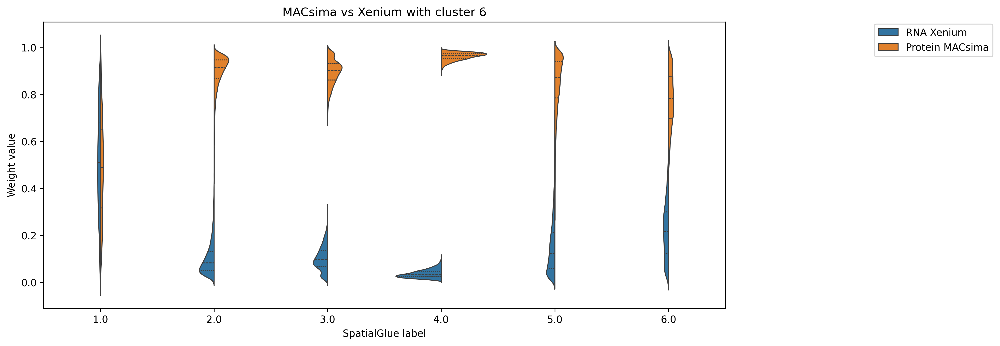
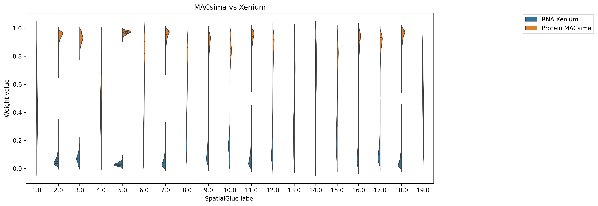
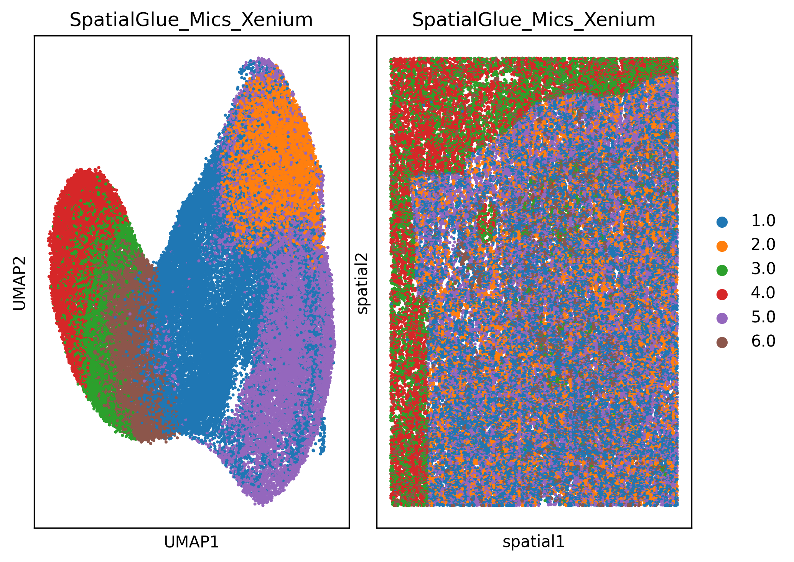

# MACsima-Xenium Data Integration Pipeline with SpatialGlue

A comprehensive pipeline for integrating MACsima (protein) and Xenium (RNA) spatial transcriptomics data using SOPA and SpatialGlue for cross-modal analysis and clustering.

## Overview

This pipeline preprocesses and integrates multimodal spatial data from MACsima and Xenium platforms, enabling joint analysis of protein and RNA expression in tissue sections. The pipeline includes:

- **Data Loading**: Import MACsima and Xenium spatial datasets
- **Cell Segmentation**: Automated cell boundary detection using Cellpose
- **Data Aggregation**: Quantification of gene expression and protein intensities per cell
- **SpatialGlue Integration**: Cross-modal integration using graph neural networks
- **Clustering Analysis**: Multi-modal clustering with mclust, Leiden, or Louvain
- **Visualization**: Comprehensive plots including UMAP, spatial, and weight distributions
- **Export**: Export to Xenium Explorer format for interactive exploration


## Results of Data Integration with SpatialGlue

<table>
<tr>
<td colspan="2" align="center">

### Original Xenium Data


*Xenium ROI1 with Seurat clusters - original spatial data*

</td>
</tr>
<tr>
<td width="50%" align="center">

### Integrated UMAP Embeddings


*Integrated MACsima-Xenium data clusters*

</td>
<td width="50%" align="center">

### Integrated Spatial Distribution


*Cluster distribution in tissue context*

</td>
</tr>
<tr>
<td width="50%" align="center">

### Weight Distribution (6 clusters)


*RNA vs Protein contribution*

</td>
<td width="50%" align="center">

### Weight Distribution (19 clusters)


*Extended clustering analysis*

</td>
</tr>
<tr>
<td colspan="2" align="center">

### 6 Clusters using Mcluster


*Detailed cluster Analysis of the Integrated MACsima-Xenium data*

</td>
</tr>
</table>

## Integration with SpatialGlue

This pipeline prepares data for SpatialGlue integration:

1. Run preprocessing pipeline
2. Use generated `adata_RNA_xenium.h5ad` and `adata_ADT_mics.h5ad` files
3. Apply SpatialGlue analysis
4. Import results back for visualization

## Pipeline Architecture

```
Spatial_Omics_Data_Integration_MACsima_Xenium/
├──  plots 
├──  config.py                     # Configuration and parameters
├──  utils.py                      # Utility functions
├──  preprocessing.py              # Data preprocessing pipeline
├──  spatialglue_integration.py    # SpatialGlue integration & clustering
├──  xenium_explorer_export.py     # Xenium Explorer export functionality
├──  run_pipeline.py               # Individual pipeline components
├──  complete_pipeline.py          # Complete integrated pipeline
├──  requirements.txt              # Python dependencies
└──  README.md                     # This file
```

## Data Processing Steps

### 1. Data Loading (Using Sopa)

- **MACsima**: Loads protein imaging data with spatial coordinates
- **Xenium**: Loads RNA transcript data with cell and nucleus boundaries

### 2. Image Preprocessing (Using Sopa and SpatialData)

- Creates image patches for efficient processing
- Identifies DAPI channel automatically for nuclear staining

### 3. Cell Segmentation (Using Sopa Cellpose)

- Uses Cellpose with pretrained models
- GPU acceleration for faster processing
- Customizable cell diameter and model parameters

### 4. Data Integration (Using Sopa )

- Merges Xenium transcript data with MACsima spatial framework
- Preserves spatial coordinates across modalities

### 5. Data Aggregation (Using Sopa )

- **Genes**: Counts transcript molecules per cell
- **Proteins**: Aggregates channel intensities per cell
- Creates separate AnnData objects for RNA and protein data

### 6. SpatialGlue Integration (Using SpatialGlue)

- **Preprocessing**: Normalization and feature extraction for both modalities
- **Graph Construction**: Builds neighbor graphs for spatial relationships
- **Model Training**: Neural network training for cross-modal integration
- **Embedding Generation**: Creates joint latent space representations

### 7. Clustering Analysis (Using R mcluster, SpatialGlue, Sopa, etc...)

- **mclust**: Model-based clustering using R mclust package
- **Leiden/Louvain**: Graph-based clustering algorithms
- **Visualization**: UMAP, spatial plots, and weight distribution analysis

### 8. Output Generation (Using anndata , SpatialData, scverse,  sopa, etc..)

- Saves processed data in H5AD format
- Exports Xenium Explorer compatible files
- Generates comprehensive visualization plots
- Includes optional clustering visualization


### Prerequisites

- Python 3.8+
- CUDA-compatible GPU (recommended for Cellpose segmentation)
- Adequate RAM (300GB+ recommended for large datasets)

### Setup Environment

```bash
# Clone or download the pipeline
cd /path/to/your/workspace

# Create conda environment (recommended)
conda create -n spatial_integration python=3.9
conda activate spatial_integration

# Install dependencies
pip install -r requirements.txt

# Install additional dependencies if needed
conda install pytorch torchvision pytorch-cuda -c pytorch -c nvidia  # For GPU support
```

## Configuration

Edit `config.py` to match your data paths and parameters:

```python
# Update these paths to match your data location
MACSIMA_DIR = Path("/path/to/your/macsima/data")
XENIUM_DIR = Path("/path/to/your/xenium/data")
OUTPUT_BASE_DIR = Path("/path/to/your/output")

# Adjust segmentation parameters
DIAMETER_PX = 18  # Expected cell diameter in pixels
RUN_WITH_GPU = True  # Set to False if no GPU available
```

## Usage

### Quick Start - Complete Pipeline

Run the entire pipeline including SpatialGlue integration:

```bash
# Complete pipeline with default settings (6 clusters, mclust)
python complete_pipeline.py

# Complete pipeline with custom parameters
python complete_pipeline.py --n-clusters 8 --clustering-method leiden --random-seed 2025

# Skip preprocessing if data already exists
python complete_pipeline.py --skip-preprocessing

# Run only SpatialGlue integration (requires existing preprocessed data)
python complete_pipeline.py --mode spatialglue-only
```

### Advanced Usage Options

```bash
# Complete pipeline with all options
python complete_pipeline.py \
  --n-clusters 6 \
  --clustering-method mclust \
  --random-seed 2025 \
  --skip-preprocessing

# SpatialGlue only with custom data paths
python complete_pipeline.py \
  --mode spatialglue-only \
  --rna-path /path/to/rna.h5ad \
  --adt-path /path/to/adt.h5ad \
  --n-clusters 8
```

### Step-by-Step Execution

#### 1. Data Preprocessing

```python
from preprocessing import main as run_preprocessing

# Run preprocessing pipeline
sdata_macs, adata_rna, adata_adt = run_preprocessing()
```

#### 2. Basic Xenium Explorer Export

```python
from xenium_explorer_export import main_basic_export

# Export for visualization
explorer_path = main_basic_export(sdata_macs)
```

#### 3. With Clustering Results

If you have SpatialGlue clustering results:

```bash
python run_pipeline.py --clustering-results /path/to/clustering_results.h5ad
```

Or programmatically:

```python
from xenium_explorer_export import main_clustering_export
import anndata as ad

# Load clustering results
clustering_results = ad.read_h5ad("clustering_results.h5ad")

# Export with clustering
explorer_path = main_clustering_export(sdata_macs, clustering_results)
```


## Output Files

The pipeline generates several output files:

```text
output_directory/
├── adata_RNA_xenium.h5ad                    # RNA expression data
├── adata_ADT_mics.h5ad                      # Protein expression data
├── macsima_aggregated.zarr                  # Aggregated spatial data
├── data_Macsim_Xenium_spatialglue_before_clustering.h5ad  # Pre-clustering results
├── data_Macsim_Xenium_spatialglue_cluster_6.h5ad          # Final integrated data
├── plots/                                   # Visualization plots
│   ├── V3_MACsimas_vs_Xenium_cluster_6.png
│   ├── umap_plot_V1_MACsimas_vs_Xenium_n_clusters6.png
│   ├── With_Annotation_SpatialGlue_Mics_Xenium_n_clusters6.png
│   └── Weight_RNA_vs_protein_final_cluster_6.png
├── xenium_explorer_output.explorer/         # Basic Xenium Explorer files
└── xenium_explorer_output_MACSima_Xenium_SpatialGlue.explorer/  # With clustering
```

## Data Formats

### Input Data
- **MACsima**: Multi-channel protein imaging data
- **Xenium**: Single-cell RNA transcript coordinates with cell boundaries

### Output Data
- **RNA AnnData**: 
  - `X`: Gene expression counts (cells × genes)
  - `obsm['spatial']`: Cell spatial coordinates
  - `obs`: Cell metadata
  - `var`: Gene information

- **ADT AnnData**:
  - `X`: Protein intensity values (cells × proteins)
  - `obsm['spatial']`: Cell spatial coordinates
  - `obs`: Cell metadata
  - `var`: Protein/channel information


### SOPA Settings

```python
sopa.settings.parallelization_backend = 'dask'  # Parallel processing
```

## Troubleshooting

**SpatialGlue Issues**:
- **R Environment**: Ensure R and mclust package are properly installed
- **Memory**: SpatialGlue requires substantial memory for large datasets
- **CUDA**: Check PyTorch CUDA compatibility for GPU acceleration
- **Convergence**: Try different random seeds if training doesn't converge

**R/mclust Setup**:
```bash
# Install R and mclust package
R -e "install.packages('mclust', repos='http://cran.rstudio.com/')"

# Check R installation
R --version
```

## Performance Tips

1. **Use GPU**: Significantly faster segmentation
2. **Parallel Processing**: Enable Dask for multi-core utilization


## References

- **SOPA**: [Spatial Omics Pipeline and Analysis,](https://github.com/gustaveroussy/sopa)
- **SpatialGlue**: [Spatial Multi-omics Integration,](https://github.com/JinmiaoChenLab/SpatialGlue)
- **SpatialData**: [An open and universal framework for processing spatial omics data,](https://github.com/scverse/spatialdata)
- **Cellpose**: [Cell Segmentation,](https://github.com/MouseLand/cellpose)
- **Xenium Explorer**: [10x Genomics Visualization.](https://www.10xgenomics.com/platforms/xenium?utm_medium=search&utm_source=google&utm_term=10x+genomics+xenium&useroffertype=website-page&utm_content=website-page&utm_campaign=7011P000001Pw8ZQAS&usercampaignid=7011P000001Pw8ZQAS&gad_source=1)


This pipeline is provided as-is for research purposes. Please cite relevant tools and methods when using in publications.

---


